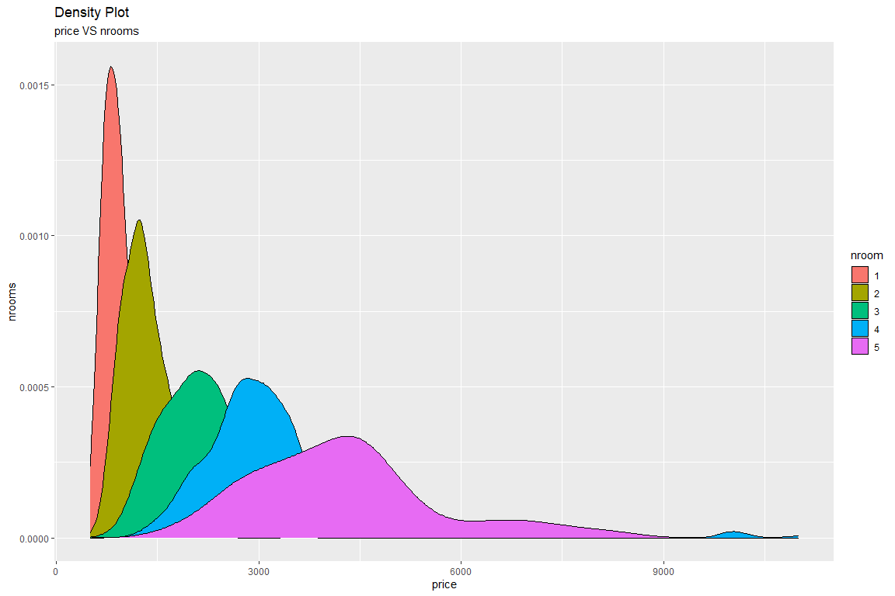

Density Plot
================

*author*: **[Niccolò Salvini](https://niccolosalvini.netlify.app/)**
*date*: 24 maggio, 2020

<p align="center">

``` r
ddataset = dataset %>%
  filter(price >= 500L & price <= 15128L)

m = ggplot(ddataset) +
  aes(x = price, fill = nroom) +
  geom_density(adjust = 1L) +
  scale_fill_hue() +
  labs(x = "price", y = "nrooms", title = "Density Plot", subtitle = "price VS nrooms")
m
```

<!-- -->

</p>
