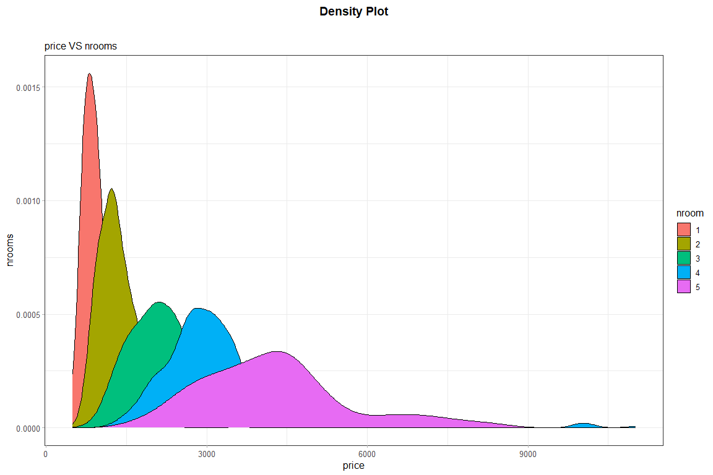

_author_: **[Niccolò Salvini](https://niccolosalvini.netlify.app/)**
_date_: `r format(Sys.Date(), "%d %B, %Y")`


```{r global.options, include=FALSE, message=FALSE}

knitr::opts_chunk$set(
  warning = FALSE,  
  strip.white = TRUE,
  fig.path = "imgOut/",
  fig.width=12,
  fig.height=8,
  cache = FALSE
)


## sourcing libs
source("libs.R")

## setting my ggplot2theme
theme_nicco = function (base_size = 11, base_family = "") {
    theme_bw() %+replace% 
    theme(
      text = element_text(family = "sans", size = 12),
      plot.title = element_text(face = "bold", size = 14),
      panel.background  = element_blank(),
      axis.ticks = element_line(colour = "grey70", size = 0.2),
      plot.background = element_rect(fill="white", colour=NA),
      legend.background = element_rect(fill="transparent", colour=NA),
      legend.key = element_rect(fill="transparent", colour=NA)
    )
}


knitr::knit_hooks$set(imgcenter = function(before, options, envir){  # to center image 
  if (before) {                                                      # add imgcenter = TRUE
    htmltools::HTML("<p align='center'>")                            # to the chunk options
  } else {
    htmltools::HTML("</p>")
  }
})

```


```{r load_data, echo=FALSE, message=FALSE}

library(readr)
library(magrittr)
library(tibble)
dataset = read_delim("data/final_dataset.csv", 
    ";", escape_double = FALSE, col_types = cols(X1 = col_skip(), 
        nroom = col_factor(levels = c("1", 
            "2", "3", "4", "5", "6"))), trim_ws = TRUE) %>% 
  as_tibble()

```

 
```{r Density_Plot}
ddataset = dataset %>%
  dplyr::filter(price >= 500 & price <= 15128)

m = ggplot(ddataset) +
  aes(x = price, fill = nroom) +
  geom_density(adjust = 1L) +
  scale_fill_hue() +
  labs(x = "price", y = "nrooms", title = "Density Plot", subtitle = "price VS nrooms") +
  theme_nicco()
m
```


```{r illustrazione, imgcenter = TRUE, echo=FALSE}


```


