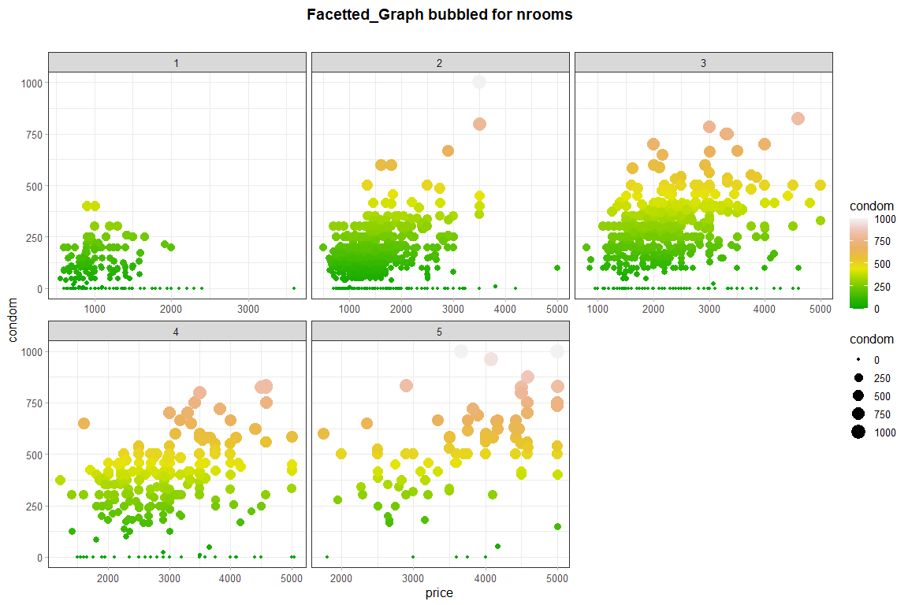

Facet Graph
================

*author*: **[Niccolò Salvini](https://niccolosalvini.netlify.app/)**
*date*: 24 maggio, 2020

``` r
ldataset = dataset %>%
  dplyr::filter(price >= 500L & price <= 5047L) %>%
  dplyr::filter(condom >= 0L & condom <= 1030L) %>%
  dplyr::filter(!(floor %in% c("NA", "12", "10")))

q = ggplot(ldataset) +
  aes(x = price, y = condom, 
      colour = condom, 
      size = condom) +
  geom_point() +
  scale_color_gradient() +
  theme_minimal() +
  facet_wrap(vars(nroom), scales = "free_x") +
  scale_colour_gradientn(colours = terrain.colors(10)) +
  ggtitle("Facetted_Graph bubbled for nrooms") +
  theme_nicco()
```

    ## Scale for 'colour' is already present. Adding another scale for 'colour',
    ## which will replace the existing scale.

``` r
q
```

<!-- -->
