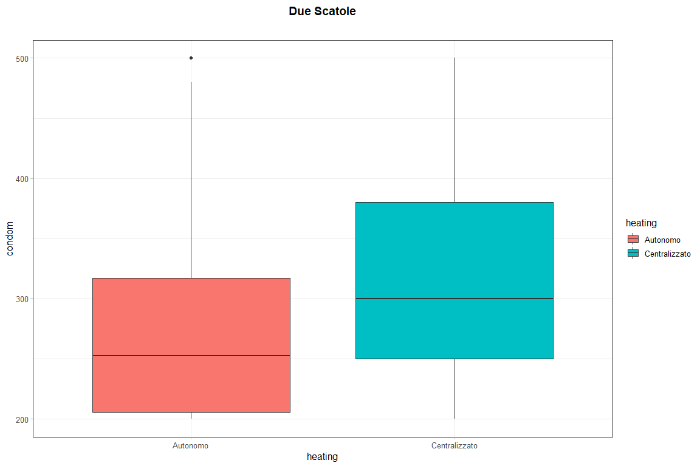

Classic 2 vars Box Plot
================

*author*: **[Niccolò Salvini](https://niccolosalvini.netlify.app/)**
*date*: 24 maggio, 2020

``` r
vdataset = dataset %>%
  dplyr::filter(condom >= 200L & condom <= 500L) %>%
  dplyr::filter(!(heating %in% "Unknown")) %>%
  dplyr::filter(!(ac %in% c("Assente", "NA", "Assente, solo freddo", "Predisposizione impianto, solo freddo", 
                     "Predisposizione impianto", "Presente", "Assente, solo caldo")))


s = ggplot(vdataset) +
  aes(x = heating, y = condom, fill = heating) +
  geom_boxplot() +
  scale_fill_hue() +
  theme_nicco() +
  ggtitle("Due Scatole") +
  theme_nicco() 
s
```

<!-- -->
