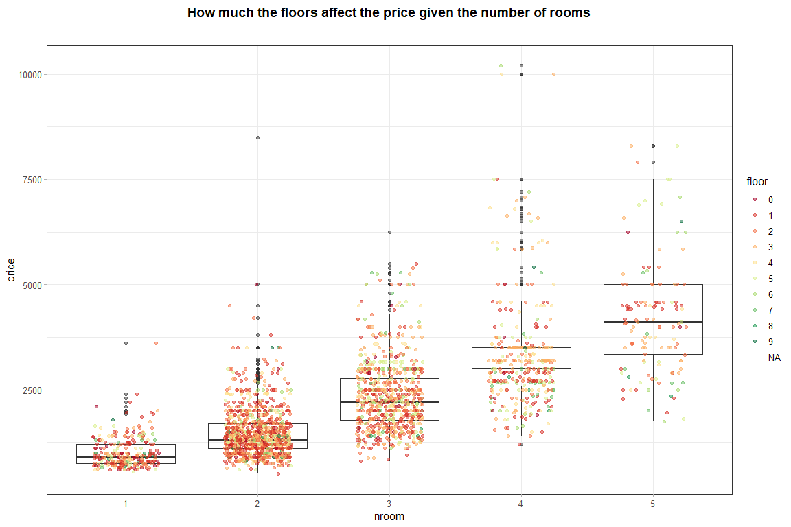

Jittered Box Plot
================

*author*: **[Niccolò Salvini](https://niccolosalvini.netlify.app/)**
*date*: 24 maggio, 2020

``` r
floordataset = dataset %>%
  dplyr::filter(price >= 500 & price <= 10581) %>%
  dplyr::filter(!(floor %in% c("NA", "12", "10"))) 


p = ggplot(data = floordataset,
           aes(x=nroom, y=price)) +
  geom_boxplot(fill=NA, alpha=0.5) +
  geom_jitter(aes(colour=floor, text=paste("price is good")), width=0.25, alpha=0.5) +
  geom_hline(yintercept=mean(dataset$price)) +
  labs(title = "How much the floors affect the price given the number of rooms",
       x = "nroom",
       y = "price") +
  theme_nicco() +
  scale_colour_brewer(type = "div", palette = "RdYlGn")
p
```

<!-- -->
